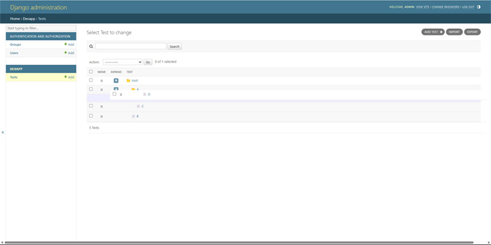
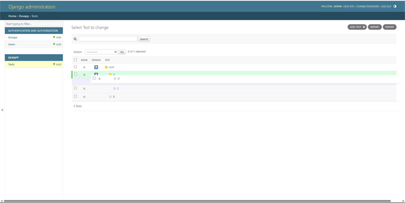

## How to Use Drag-and-Drop

**The Treenode Framework** offers a flexible and intuitive Drag-and-Drop (D-n-D) interface for rearranging nodes within the tree.  
However, to use it correctly and avoid unexpected results, please follow these guidelines:

#### How to use

**How to Drag**:

- To move a node, **grab it by the drag handle button** (`≡` or `↕`).
- **Do not** try to drag the row itself — always use the handle.
- Begin dragging **normally** — do not press any keys yet.

**How to Drop**. There are two distinct drop modes:

- **Insert after a node**: Drag normally (no keys). The dragged node becomes a sibling **after** the target node. 
- **Insert as a child**: Hold **Shift** while dragging. The dragged node becomes a **child** of the target node.
- While dragging:
    - A **purple cursor** indicates "Insert after" mode (default).
    - A **green cursor** appears when **Shift** is pressed, indicating "Insert as child" mode.

_The purple cursor indicates "Insert after" mode. The node will be inserted as a sibling after the target node._

_The green cursor indicates "Insert as child" mode. The node will become a child of the target node._

!!! tip
    - **First start dragging, then press Shift.**  
      Do not press Shift before starting the drag action — otherwise the shift state might not be properly recognized.
    - **Inserting after a parent node does not make the node the first child.**  
      If you drag a node and drop it after a parent node without Shift:

        - The node becomes a **sibling** to the parent's other children.
        - It will be placed **at the end of the sibling list**, not at the top.

    - **To make a node the first child** of another node, you must:

        1. Start dragging,
        2. Press **Shift** during the drag,
        3. Drop onto the target parent node.

---

#### Common Mistakes to Avoid

| Mistake                  | What happens               | Correct way                     |
|:---------------------------|:----------------------------|:---------------------------------|
| Pressing Shift before starting drag | Shift state not detected properly | First drag, then press Shift |
| Dropping after a parent node without Shift | Node becomes last among siblings | Use Shift to insert as a child |
| Trying to drag the entire row | Dragging won't start | Always use the drag handle |

